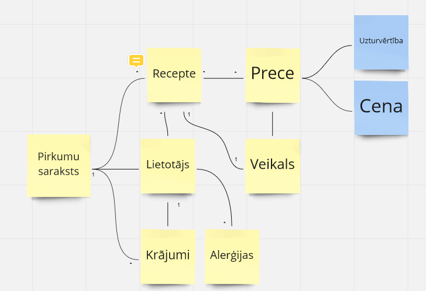
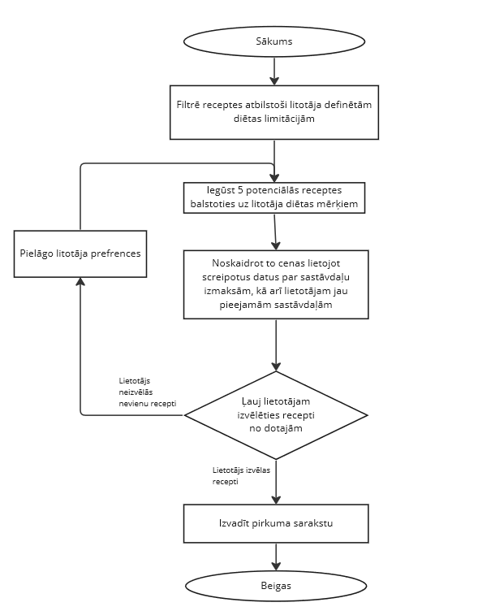

# Sabalansētas ēdienkartes plānošana: projektējuma dokuments
# 1.Ievads

## 1.1 Problēmas nostādne

Mūsdienu 

## 1.2 Darba merķis
Darba rezultatā tiks izveidota vietne, kas palīdzēs cilvēkam no viņam pieejamiem porduktiem izveidot recepti, kas iekļautu savu uzturvērtību un cenu.

# 2. Līdzīgo risinājumu pārskats

* https://www.supercook.com/#/desktop  Uzsvars uz zero waste, pievilcīgs dizains, vairāku ēdiea blogu apkopojums, pats ievada sastāvdaļas.
* https://myfridgefood.com/ Ne tik parocīgs, bet ļoti vienkāršs dizains, lietotāju definētas receptes.
* https://www.allrecipes.com/ Piemērots ēdiena entuziastiem, receptes iesniedz un novērtē lietotāji, pēc būtības tas ir blogs/sociālais medijs

Sabalansētas ēdienkartes lietotņu salīdzinājums ir redzams 1.tabulā.

### 1. tabula. Līdzīgo risinājumu pārskats

| Nosaukums | Priekšrocības | Trūkumi |
| --- | --- | --- |

# 3. Tehniskais risinājums
## 3.1 Prasības
Sistēmas lietotāji:
* lietotāji

Prasības ir apkopotas 2. tabulā.

### 2. tabula. Lietotāju stāsti

| Prasības ID | Lietotāja stāsts | Prioritāte |
| --- | --- | --- |
|  |  |  | 
| P1 | Lietotājs ar vietnes palīdzību spēj sev aatrast piemērotu recepti. | M | 
| P2 | Lietotājam ir iespēja apskatīties satāvdaļas, uzturvērtības un cenu. | S |
| P3 | Lietotājam ir iespēja izvēlēties no vairākm receptēm | S |
| P4 | Lietotājam tiek piedāvātas receptes ņemot vērā viņa alerģijas | C |
| P5 | Lietotājam ir iespēja dažādot savu uzturu. | W |

## 3.2 Konceptu modelis
Sabalansētas ēdienkartes svarīgākie koncepti ir:
* Lietotājs
* Recepte
* Uzturvērtība
* Prece
* Cena
* Veikals
* Krājumi
* Alerģijas

Konceptu apraksts ir dots 3. tabulā. Konceptu modelis ir dots 1. attēlā.
### 3.tabula. Konceptu apraksts

| Koncepta ID | Koncepta nosaukums | Apraksts |
| --- | --- | --- |
| K1 | Lietotājs | Cilvēks, kurš pielieto tīmekļa vietni. |
| K2 | Recepte | Sastāva un pagatavošanas paņēmiena apraksts. |
| K3 | Uzturvērtība | Uzturvielu un kaloriju daudzums attiecīgajā receptē.| 
| K4 | Prece |  |
| K5 | Cena | Receptes pagatavošanas paredzētās izmaksas. |
| K6 | Veikals |  |
| K7 | Krājumi | Pieejamais produkta daudzums e-veikalā. |
| K8 | Alerģijas | Lietotāja definētās alerģijas. |

### 1. attēls. Konceptu modelis

# 4. Tehnoloģiju steks 

### 4.tabula. Tehnoloģiju steks servera puse
| Nosacījums  | Vide | 
| --- | --- |
| Satvars | Laravel | 
| Programmēšanas valoda | Php | 
| Datu bāze  | MySQL | 
| Tīmekļa serveris | Apache | 
| OS | Ubuntu | 
| Serveris | HyperV | 

### 5.tabula. Tehnoloģiju steks klienta puse

| Nosacījums  | Vide | 
| --- | --- |
| Programmēšanas valoda | Php | 
| Palīglīdzeklis| HTML, CSS | 
| Ierīce | Dators vai viedtālrunis | 
| Internets | Pārlūks | 

# 5. Novērtējums

## 5.1 Novērtējuma mērķis

## 5.2 Novērtēšanas mēri

## 5.3 Novērtējuma plāns

### 6. tabula. Novērtējuma plāns

# Algoritms

### 2. attēls. Algoritms

